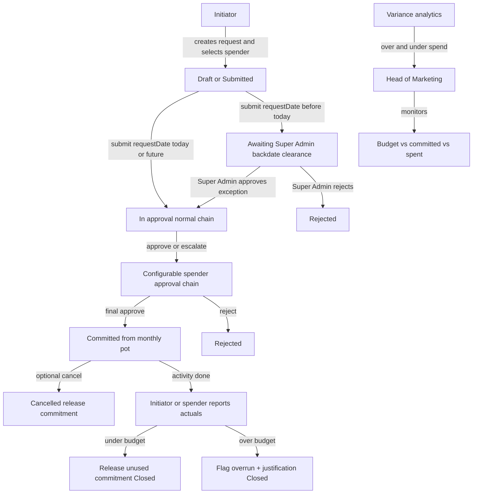

# Marketing Expense Tracker — Product Understanding & Plan

## Shared understanding

You want a **dynamic, configurable web app** that works well on **PC and mobile** (responsive; native/mobile app can come later) so marketing teams at Yamaha Motorcycles Bangladesh (ACI Motors Ltd.) can request budget, get it approved through a **multi-level line-manager chain**, execute activities, then report **actual spend**—while the **Head of Marketing (HoM)** always knows how much of the **single monthly marketing pot** is used, committed, and left.

**Marketing staff** (field users, coordinators, line managers) are **one user type**: they can **initiate requests**, be selected as **spender**, and **report actuals**. On each request an initiator (submitted by) selects a spender (on behalf of); these may be the same person. Approval still follows the **spender’s** line managers (`manager_id` chain), not the initiator’s.

### Roles (conceptual)

| Role | What they do |
|------|----------------|
| **Marketing staff** | Unified type for initiators, spenders, and line managers: create/submit requests, be selected as spender, report actuals. Spatie role **`staff`** (legacy `initiator` / `spender` kept for compatibility). |
| **Approval (chain-based)** | **Not a separate exclusive role.** A user approves when they appear in the **spender’s `manager_id` chain** (current pending step). Line managers, HoM, and others can initiate/spend **and** approve others’ requests. Legacy `approver` role may remain for display only. |
| **Head of Marketing** | Everything **staff** can do, plus owns the monthly pot, HoM dashboard, variance analytics, and admin config (with admin/super_admin). |
| **Admin / configurator** | Everything **staff** can do, plus maintains users, teams, categories, budgets, and rules. |
| **Super Admin** | Everything **staff** + admin can do, plus **must clear backdated requests** before the normal approval chain. |

Prefer assigning Spatie role **`staff`** to all marketing users (including HoM, line managers, super_admin). Alternatively assign both **`initiator`** + **`spender`**. Elevated users (`head_of_marketing`, `admin`, `super_admin`) retain their extra roles **and** staff capabilities.

Users who never log in can still exist as selectable spenders so field/dealer staff are not blocked.

### Core money states (first-class commitment)

For one shared pot, track three different amounts so the dashboard stays honest and **double booking is avoided**:

1. **Requested** — amount asked for the spender’s activity (not yet approved; shown separately, does **not** reduce Available)
2. **Committed (approved)** — approved but not yet reported as spent (money **reserved**; reduces Available)
3. **Actual spent** — what was really used after the activity

**Available balance** for HoM:

`Monthly budget − Committed − Actual spent`

Pending (unapproved) requests are visible for pipeline visibility but do **not** reserve the pot until final approval.

When actual &lt; approved → **release** the unused commitment back to the pot.  
When actual &gt; approved → **allow**, **flag overrun**, require **justification**; no second approval chain (per your decision).

### Process the app should mirror

1. **Initiator** creates a marketing budget request, **selects the spender/concerned person**, and fills **mandatory context** (purpose, amount, dates, location, category, expected outcome, etc.), including a **request date** (when the budget was sought / verbally approved).
2. **Backdate rule:** if **request date &lt; today**, the case is flagged as backdated (e.g. verbal/email approval already happened, activity may already be done). It goes to **Super Admin first**. Only after Super Admin clears the exception does the request enter the **regular spender approval chain**. If request date is today or in the future, Super Admin gate is **skipped**.
3. Otherwise the request moves through a **full lifecycle** (draft → submitted → [optional Super Admin gate] → in approval → approved / rejected / cancelled → actuals → closed).
4. Approval follows a **configurable chain** based on the **spender** (org hierarchy first; amount/category shortcuts later).
5. On final approval, the amount is **committed** against the monthly pot.
6. The spender executes the activity (or may already have, in backdated cases).
7. **Initiator or spender** reports **actual amount**; if higher than approved, they must enter **why**. Unused commitment is released on close; overruns are flagged.
8. HoM and managers see pot usage, remaining budget, overruns, and **variance analytics** (over- and under-spend).
9. Users get **in-app and email notifications** for approvals, outcomes, and SLA-style reminders (including Super Admin for backdated queue).
10. Every meaningful action is kept in an **immutable audit trail**.

Audit trail always stores both **submitted by (initiator)** and **on behalf of (spender)**, plus backdate clearance by Super Admin when applicable.

### What “fully dynamic and configurable” means here

Without redeploying code, authorized admins should be able to change:

- Users, roles (who may initiate vs who may be selected as spender), teams, and who reports to whom (approval chain)
- Approval-chain rules (and later amount/category shortcuts)
- Monthly budget amount and budget period (calendar month or company FY month)
- Request categories / activity types and mandatory request fields
- Notification and reminder thresholds
- Who can see which dashboards and exports

---

## Confirmed product decisions

- **Budget model:** one **shared monthly marketing pot** (not pre-split by team/category). Team/category are labels and filters (and analytics dimensions), not hard sub-budgets unless soft allocations are added later.
- **Overrun of approved amount:** allowed; **must be justified**; visible as variance; **no re-approval**.
- **Who creates the request:** an **initiator**, who **selects the spender/concerned person**.
- **Approval chain:** follows the **spender’s** managers, not the initiator’s; **admin-configurable**.
- **Who reports actuals:** **either** initiator **or** spender.
- **Commitment is first-class:** Available = monthly budget − committed − actual; only final approval commits; under-spend releases unused commitment; pending does not reserve.
- **Request lifecycle:** Draft / Submitted / **Awaiting Super Admin (backdate)** / In approval / Approved / Rejected / Cancelled / In progress / Partially reported / Closed; cancel unused approval releases commitment; multiple actual entries against one approval supported where useful.
- **Mandatory context on every request:** objective/campaign name, channel/category, planned dates/location, expected outcome; vendor optional at request (stronger at actuals); attachments (brief, quotation, invoice, receipt, photos).
- **Variance analytics:** overrun and under-spend by request, team, category, month (amount and %); patterns for coaching and better planning.
- **Notifications and SLA:** in-app + **email** (WhatsApp not required)—approval needed (line managers + Super Admin backdate queue), approved/rejected, reminder if no actuals after activity end date, HoM alerts at pot utilization thresholds (e.g. 80%, 100%).
- **Audit trail:** immutable history of submitter, spender, Super Admin backdate clearance, approvers, comments, amount changes, justifications, timestamps.
- **Clients:** **PC and mobile friendly** (responsive web). Native app is a later option on the same backend, not the primary design target.
- **Tech stack (confirmed):** Laravel + MySQL + Livewire/Blade (details below).
- **Visual design (confirmed):** Sleek, ultra-modern, minimal UI aligned with the Yamaha logo ([yamaha logo.jpg](yamaha%20logo.jpg))—red, black, white/silver (details below).
- **Input fields (proposed MVP):** see **User input fields** below—confirm or adjust before build.
- **Backdated requests:** allowed. If **request date &lt; current date**, Super Admin must approve the exception **before** the normal approval chain starts. If request date is today or later, this gate does **not** apply.
- **Budget month attribution:** commitment and actuals count against the request’s **Budget month** (defaults from request date), not the spend date.

---

## Backdated requests (confirmed)

**Problem:** Sometimes the concerned person gets **verbal or email** budget approval, runs the activity and spends, but the request was never entered in the system.

**Rule:**
- Users may enter a **request date earlier than today**.
- The system compares **request date** to **current date** (server date) only.
- **If request date &lt; today:** status becomes e.g. `Awaiting Super Admin (backdate)`; Super Admin must **approve or reject** the exception.  
  - Approve → request then enters the **regular** spender line-manager chain (same as a normal request).  
  - Reject → request stops; no commitment; reason required.
- **If request date ≥ today:** normal submit → regular chain; **no** Super Admin backdate step.

**Extra inputs when backdated (required):**
- **Request date** (the prior date of the verbal/email ask or approval)
- **Backdate reason** (why it was not entered on time)
- **Evidence** strongly recommended: forward of email approval / note of who verbally approved (attachment or text)

**Visibility:** HoM/analytics can filter “backdated” cases; audit log records Super Admin clearance separately from line approvals.

**Note:** Super Admin clearance is **not** a substitute for line approval—it only unlocks the normal chain for late entries.

## User input fields (proposed MVP)

Two main data-entry moments: **(A) budget request** and **(B) actual expense report**. Approvers mainly act (approve / reject / comment), not fill long forms. HoM/admin set the monthly pot separately.

### A. Budget request (entered by Initiator)

| Field | Required? | Notes |
|--------|-----------|--------|
| **Spender / concerned person** | Yes | Selected from directory (not free text) |
| **Team** | Yes | Often auto-filled from spender; editable if needed |
| **Category / channel** | Yes | e.g. digital, event, dealer support, POSM, media (admin-configurable list) |
| **Objective / campaign name** | Yes | Short title for the activity |
| **Description / purpose** | Yes | What will be done and why |
| **Expected outcome** | Yes | Brief success note (e.g. leads, visibility, dealer engagement) |
| **Requested amount (BDT)** | Yes | Amount seeking approval |
| **Request date** | Yes | Date the budget was requested / verbally or by email approved. Defaults to **today**. May be set earlier for late entries. |
| **Budget month** | Yes | Which monthly pot this hits. Defaults from request date; editable (e.g. late entry still against intended month). |
| **Backdate reason** | Yes if request date &lt; today | Why the request was not entered on time |
| **Prior approval evidence** | Recommended if backdated | Email screenshot/PDF or note of who gave verbal approval |
| **Activity start date** | Yes | Planned (or actual, if already done) start |
| **Activity end date** | Yes | Planned (or actual) end (drives “actuals overdue” reminders) |
| **Location** | Yes | Area, dealer, city, venue, etc. |
| **Vendor / agency** | Optional | Stronger at actuals if unknown at request time |
| **Attachments** | Optional* | Quotation, brief, estimate (*admin may make quotation mandatory for some categories later) |
| **Internal notes** | Optional | Visible to approvers; not part of public summary |

**Auto-captured (not typed):** initiator (submitted by), **system submission timestamp** (always “entered on” today—distinct from request date), approval chain derived from spender, budget month/period, **backdated flag** when request date &lt; today.

**Approver input (light):**
- **Super Admin (backdated only):** clear or reject exception + required comment/reason.
- **Line approvers:** approve / reject / escalate + optional **comment**; rejection should require a short reason.

### B. Actual expense report (Initiator or Spender)

Reported against an **approved** request (one or more entries allowed).

| Field | Required? | Notes |
|--------|-----------|--------|
| **Linked request** | Yes | Chosen from approved / in-progress requests |
| **Actual amount (BDT)** | Yes | What was really spent (this entry) |
| **Spend date** | Yes | When the cost was incurred / paid |
| **Vendor / payee** | Yes | Who was paid |
| **What was purchased / done** | Yes | Short note if different from request description |
| **Overrun justification** | Yes if actual (total) &gt; approved | Mandatory explanation when over approved budget |
| **Attachments** | Yes* | Invoice / receipt / proof (*at least one proof document recommended as required in MVP) |
| **Mark request closed?** | Optional | If final entry; otherwise leave open for further actuals |

**System-calculated:** variance amount and %, remaining commitment released on close, overrun flag for HoM/analytics.

### C. HoM / Admin (not day-to-day expense entry)

| Field | Purpose |
|--------|---------|
| **Monthly marketing budget (BDT)** | Set pot for the period |
| **Budget period** | Month / FY month |
| Users, teams, categories, approval lines | Configuration |

### Intentionally not in MVP request/actual forms

- Full accounting codes / GL (export to Finance later)
- Detailed ROI KPIs (leads, footfall)—Phase 3 optional
- WhatsApp-linked fields

---

## Confirmed tech stack

| Layer | Choice |
|--------|--------|
| Backend | **Laravel (PHP)** |
| Database | **MySQL / MariaDB** (XAMPP-friendly) |
| Web UI | **Blade + Livewire** (+ Alpine as needed), responsive for PC and mobile |
| Auth / roles | Laravel auth + **Spatie Permission** (`staff`, legacy initiator/spender/approver, HoM, admin, **super admin**); approval gated by spender `manager_id` chain |
| Email notifications | **Laravel Mail** + queue |
| File uploads | Local disk in MVP; S3-compatible storage later |
| Future mobile API | **Laravel Sanctum** when a native app is needed |
| Local / hosting | **XAMPP Apache** locally + **shared cPanel** (no `php artisan serve`, no SSH/terminal required) — see below |

**Out of scope for v1:** native app first, microservices, WhatsApp gateway, long-running queue workers that need Supervisor.

---

## Hosting & runtime (confirmed — no `artisan serve`)

The app must run as a normal website under **Apache**, not via Laravel’s built-in server.

### Local (XAMPP)

- Project under `htdocs` as `d:\xampp\htdocs\ymb-met`.
- Must open in the browser as **`http://localhost/ymb-met/`** (not `.../public`).
- Achieve this with a **root `.htaccess`** (and/or front-controller) that routes all web traffic into Laravel’s `public/` folder, so users never type `/public`.
- **`php artisan serve` is not used and not required.**
- MySQL via XAMPP; `.env` points to local DB. `APP_URL=http://localhost/ymb-met` (subdirectory-aware asset/URL config).

### Shared cPanel (no terminal / no SSH)

- Prefer document root (or subdomain) pointed at Laravel’s **`public/`** folder when cPanel allows it.
- If the app must live in a subdirectory (like local), use the same **root → public rewrite** pattern so the URL has no `/public` segment.
- **`php artisan serve` is not used and not required** on the server.
- Deploy by uploading files (FTP/File Manager). Prefer building `vendor/` on a machine that has Composer, then upload—do not assume SSH Composer on cPanel.
- Database: create MySQL DB/user in cPanel; set `.env` via File Manager.
- Migrations / first setup: use a **one-time web installer** or protected setup route (or run migrations from local against the remote DB once)—so production does not depend on terminal `php artisan migrate`.
- Queues: **`sync` or database** driver suitable for shared hosting (no Supervisor). Scheduled reminders: **cPanel Cron** calling `php /home/.../artisan schedule:run` if the host allows PHP CLI in cron; otherwise reminder checks can run on web requests (lightweight fallback).
- Storage: `storage/` and `bootstrap/cache/` writable; `php artisan storage:link` equivalent handled in deploy/installer (or public symlink/copy strategy compatible with cPanel).

### Constraint summary

| Environment | How the app is served |
|-------------|------------------------|
| Local XAMPP | Apache → **`http://localhost/ymb-met/`** (root rewrite into `public/`) |
| Shared cPanel | Apache → `public/` as docroot, or subdirectory with same no-`/public` URL |
| Never required | `php artisan serve` |

---

## Budget month attribution (confirmed)

- Each request has an explicit **Budget month** (defaults from **request date**, editable by initiator if needed).
- **Commitment and actuals both count against that Budget month’s pot**, regardless of when cash was actually spent.
- **Spend date** is kept for audit/operations only; it does **not** move the cost to another month’s pot.

**Example:** Request in **September**, expenditure in **October** → counts against the **September** pot (when Budget month = September).

---

## Confirmed visual design (Yamaha-aligned)

Brand reference: [yamaha logo.jpg](yamaha%20logo.jpg) — tuning-fork emblem, bold **YAMAHA** wordmark, “Revs Your Heart” with speed line.

### Direction

- **Sleek, ultra-modern, minimal** — lots of whitespace, thin precise dividers, restrained chrome; no cluttered cards or dashboard noise.
- **Not** purple gradients, cream/terracotta, or heavy glassmorphism for its own sake. Yamaha = speed, precision, engineering.

### Palette (CSS variables)

| Token | Role | Approx. value |
|--------|------|----------------|
| `--yamaha-red` | Primary brand / primary CTAs | `#E60012` (Yamaha-typical red; refine from logo asset) |
| `--yamaha-black` | Text, nav, strong accents | `#111111` / `#000000` |
| `--yamaha-white` | Surfaces | `#FFFFFF` |
| `--yamaha-silver` | Borders, muted chrome, subtle UI metal | `#C8C8C8` → `#8A8A8A` |
| `--surface-muted` | Page background / secondary panels | Near-white cool gray (e.g. `#F5F5F5`) |
| `--danger-red` | Overrun / over-budget flags | Same family as brand red, used sparingly |

### Typography

- **UI / body:** Modern geometric **sans-serif** (tight, industrial—not Inter/Roboto/Arial defaults if avoidable; e.g. something in the spirit of bold condensed brand lettering for display, clean sans for body).
- **Headings:** Strong, uppercase or tightly tracked where it fits brand (sparingly—login/header, not every label).
- **Avoid** decorative script in the app UI (slogan script stays on the logo only).

### Layout & components

- Logo in header (emblem + wordmark as appropriate); brand readable without competing with page titles.
- Primary actions in **Yamaha red**; secondary actions outline black/silver.
- Thin hairline borders / silver rules instead of heavy shadows or thick card frames.
- Progress / pot utilization bars can echo the logo’s **speed line** (sharp, linear)—not chunky pill meters.
- Status colors minimal: red for overrun/critical, black/gray for neutral, restrained success green only where needed.
- Dense data (tables, approval queues) stay clean on **desktop**; same system scales to **mobile** with stacked layouts—not a separate “mobile theme.”

### Motion

- 2–3 intentional motions only (e.g. subtle page/section enter, progress fill, approval state change)—precision over flash.

### Assets

- Use [yamaha logo.jpg](yamaha%20logo.jpg) (or a cleaned SVG/PNG export) as the official mark in the app chrome; keep clear space around the emblem.

---

## Still optional / later (not confirmed for MVP core)

### Soft controls on the monthly pot

- Warn when approval would push committed + spent over the monthly budget.
- Optionally only HoM can force-approve when the pot would go negative.

### Delegation and absence

- Temporary delegation of approval rights when managers are on leave.

### Finance handoff

- Excel/PDF export of closed requests for Finance (design for it; full ERP later).

### Future enhancements

- Soft team/category indicative allocations  
- Campaign objects, vendor master, KPI/ROI fields  
- Amount-based / category-based approval shortcuts (after basic configurable chains work)  
- Native or wrapper mobile app  
- ERP/accounting integration  
- Multi-year / FY carry-forward rules  

---

## Confirmed capabilities in detail

### Commitment (avoid double booking)

- HoM dashboard always shows **Budget / Committed / Spent / Available** as separate figures.
- Approving two large requests both reduces Available immediately via commitment—even before anyone spends.
- Closing under budget returns the unused slice to Available.
- Reporting above approved does not invent a new “approved” amount; it increases Spent and flags variance with justification.

### Configurable approval chains

- **MVP:** org-hierarchy escalation from the **spender** (manager → … → final approver), editable by admin as people and reporting lines change.
- **Later:** amount ≤ X → shorter chain; amount &gt; X or certain categories → must reach HoM.

### Request lifecycle

| Status | Meaning |
|--------|---------|
| Draft | Initiator saving work |
| Awaiting Super Admin (backdate) | Request date &lt; today; Super Admin must clear exception before line chain |
| Submitted / In approval | Waiting in the normal spender approval chain |
| Approved | Final approval; amount committed |
| Rejected | Denied (by Super Admin or line); no commitment |
| Cancelled | Unused approved request withdrawn; commitment released |
| In progress / Partially reported | Activity ongoing; one or more actual entries |
| Closed | Actuals complete; variance settled |

### Mandatory context

Every request must capture enough for audit and monthly review: objective/campaign, category/channel, dates, location, expected outcome, amount, spender, and supporting attachments as the process requires.

### Overrun + under-spend analytics

- Per request: approved vs actual, variance amount and %.
- Aggregates by team, category, month.
- Surfaces both chronic overruns and systematic under-ask / over-ask for planning quality.

### Notifications and SLA (no WhatsApp)

- In-app + email for: needs approval, approved, rejected.
- Super Admin notified when a **backdated** request awaits clearance.
- Reminder when activity end date has passed and actuals are missing.
- HoM email/in-app when pot utilization crosses configured thresholds.

### Audit trail

- Who submitted, on whose behalf, Super Admin backdate clearance (if any), who approved/rejected in the line chain, comments, amount edits, overrun justifications, request date vs entered-on date, timestamps—retained for internal audit and management review.

### UX: PC and mobile

- Office users (initiators, HoM, admin) primarily on **desktop/laptop**; full tables, dashboards, filters.
- Field / on-the-go users on **phone/tablet**; same flows usable without a separate app in v1.
- Approvals and actual entry must work comfortably on both form factors.
- Visual system follows **Confirmed visual design** (Yamaha red/black/white, minimal, logo in header).

---

## Suggested product phases

### Phase 1 — MVP

- Users, roles, teams (`staff` / legacy initiator·spender; chain-based approval; **super admin**; multi-role OK)
- Configurable monthly pot + period
- Request form with **mandatory spender** + **mandatory context fields** + **request date**
- **Backdated path:** if request date &lt; today → Super Admin clearance, then normal chain
- Configurable multi-level approval along **spender’s** line
- Full status lifecycle including cancel/release and close
- First-class **commit / release** against the pot
- Actuals by initiator or spender; overrun justification required
- HoM dashboard: budget, committed, spent, remaining, overrun list (incl. backdated filter)
- Basic **variance views** (over/under by request and filters)
- In-app + email notifications for approval flow, Super Admin backdate queue, and basic reminders
- Immutable **audit log** + Excel export
- Responsive UI for **PC and mobile**
- **Yamaha-aligned** sleek minimal theme (CSS variables, logo in chrome)

### Phase 2 — Operational robustness

- Richer variance analytics and recurring-pattern views
- Soft pot warnings / HoM override
- Delegation, richer reminder SLAs, utilization threshold alerts
- Stronger attachment/vendor handling
- Full admin screens for all configuration

### Phase 3 — Scale and optional native app

- Amount/category approval shortcuts, soft allocations
- Campaigns / ROI fields
- Optional native/wrapper app on the same API
- Finance/ERP integrations if needed

---

## Open points to decide later (non-blocking for vision)

- Exact org chart and who is “final approver” vs HoM  
- Soft-block vs warn-only when the monthly pot would be exceeded on approval  
- Whether pending requests reserve budget (**confirmed recommendation: only approved commits**)  
- Budget period: calendar month vs company financial month  
- Who may edit configuration (IT vs marketing ops)  
- Whether an initiator may act for **any** spender or only people in assigned teams (recommend: restrict by team in MVP)  
- Whether spenders without login are allowed (recommend: yes—selectable directory even if they never sign in)  

---

## What comes next

Stack and visual direction are confirmed. Next step when you are ready: a **detailed technical architecture** on this stack—data model (users, requests, commitments, actuals, audit), modules/screens, auth matrix, email/queue setup, design-token implementation, XAMPP → production hosting, and phased delivery timeline. Then implementation can begin.

---

## Bottom line

The app is a **configurable marketing spend control loop** for **PC and mobile**, implemented with **Laravel + MySQL + Livewire/Blade** and a **sleek, Yamaha-branded minimal UI** (red / black / white-silver from [yamaha logo.jpg](yamaha%20logo.jpg)): **initiator requests on behalf of a spender → (if backdated: Super Admin clearance first) → configurable approval on the spender’s chain → commit from one monthly pot → full request lifecycle → actuals with overrun justification → variance analytics and notifications → audit trail and HoM visibility**. Robustness comes from **first-class commitment, clear lifecycle, mandatory context, variance insight, and accountable history**—not from blocking every overrun.
